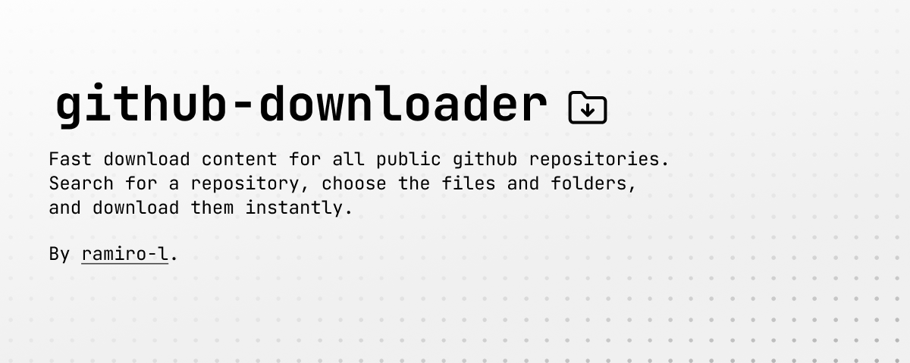

# Repo Downloader

**[Repo Downloader](https://repo-downloader.pages.dev/)** is a practical web tool that allows you to download only the files you need from a repository. No more unnecessary cloning. Select branches, explore submodules, and get exactly what you want with ease and speed.

## Features 🚀

-   **Selective Download**: Pick and download specific files or folders.
-   **Branch Navigation**: Easily access and switch between repository branches.
-   **Submodule Management**: Explore and download content from git submodules effortlessly.

## How to Contribute 🤝

We love contributions from the community! Whether you have ideas for new features, bug fixes, or improvements to the documentation, check out our [Contributing Guidelines](CONTRIBUTING.md) to learn how to get involved.

## License 📝

This project is licensed under the [MIT License](LICENSE).
