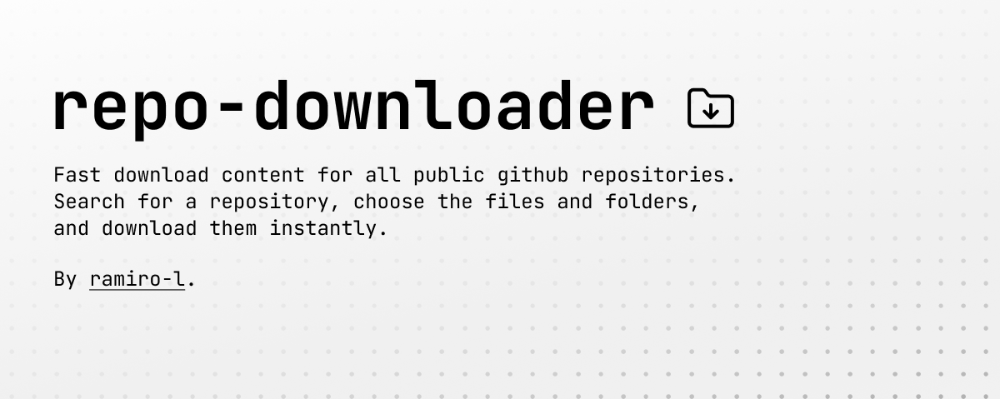

# Repo Downloader

This is a simple web application that allows you to download files from a public Github repository. Select the repository, the branch and the file you want to download and click on the download button. The file will be downloaded.
